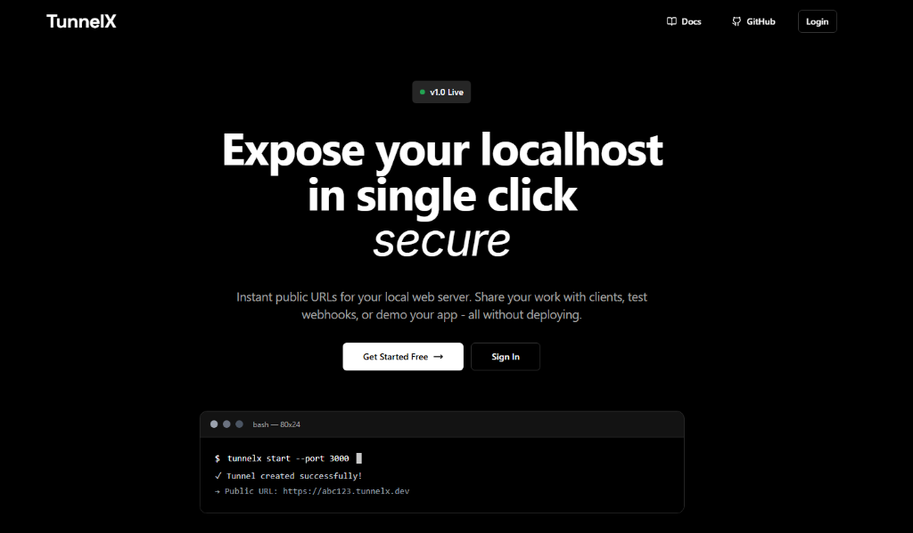

# TunnelX

**Expose your localhost to the internet.**

TunnelX is a professional, secure, and lightweight command-line tool that creates a secure tunnel from the public internet to your local machine. It creates a bridge between the public internet and your local web server, allowing you to share your work, test webhooks, and develop locally with a secure public URL.



## Features

- **Instant Public URL**: Get a secure `https` URL for your localhost server immediately.
- **Secure Tunnels**: All traffic is encrypted and securely forwarded.
- **WebSocket Support**: Full support for real-time applications and WebSockets.
- **Request Inspection**: Real-time logging of incoming requests (Method, Path, Status).
- **Persistent Identity**: maintain your tunnel metrics and history.
- **Cross-Platform**: Works on Windows, macOS, and Linux.

## Installation

Install TunnelX globally using npm:

```bash
npm install -g tunnelx
```

Or run it directly with `npx` without installation:

```bash
npx tunnelx start --port 3000
```

## Quick Start

### 1. Register
Create a free account to get started.

```bash
tunnelx register
```

### 2. Login
Authenticate your CLI client.

```bash
tunnelx login
```

### 3. Start a Tunnel
Expose your local server running on a specific port (e.g., 3000).

```bash
tunnelx start --port 3000
```

## Example Output

```bash
$ tunnelx start --port 3000

TunnelX Tunnel
==================================================

[Success] Tunnel created!
Tunnel ID:  abc123xyz
Public URL: https://abc123xyz.tunnelx.dev
Forwarding: https://abc123xyz.tunnelx.dev -> http://localhost:3000

[Success] Tunnel is active!
Press Ctrl+C to stop

[INFO]  GET  /api/users      200 OK
[INFO]  POST /webhooks/stripe 201 Created
```

## Commands

| Command | Description | Usage |
|---------|-------------|-------|
| `tunnelx register` | Create a new TunnelX account | `tunnelx register` |
| `tunnelx login` | Login to your account | `tunnelx login` |
| `tunnelx start` | Start a tunnel on a specific port | `tunnelx start --port <port>` |
| `tunnelx whoami` | Check currently logged-in user | `tunnelx whoami` |
| `tunnelx logout` | Logout from the CLI | `tunnelx logout` |
| `tunnelx --help` | Show help and usage details | `tunnelx --help` |

## How It Works

1.  **Client Connection**: The TunnelX CLI establishes a secure WebSocket connection to the TunnelX Server.
2.  **Public Endpoint**: The server provisions a unique subdomain (e.g., `yourapp.tunnelx.dev`).
3.  **Request Forwarding**: Incoming requests to the public URL are routed through the WebSocket tunnel to your CLI.
4.  **Local Execution**: Your CLI proxies the request to your local server (e.g., `localhost:3000`) and returns the response.

## Troubleshooting

**Port already in use**
Ensure no other instance of TunnelX is running.
`killall node` (macOS/Linux) or check Task Manager (Windows).

**Connection refused**
Verify that your local web server is running on the specified port before starting the tunnel.

## Contributing

Contributions are welcome. Please submit a Pull Request on our GitHub repository.
Repository: [github.com/Devesh-x/TunnelX](https://github.com/Devesh-x/TunnelX)

## License

This project is licensed under the MIT License.

## Author

**Devesh Rajput**
